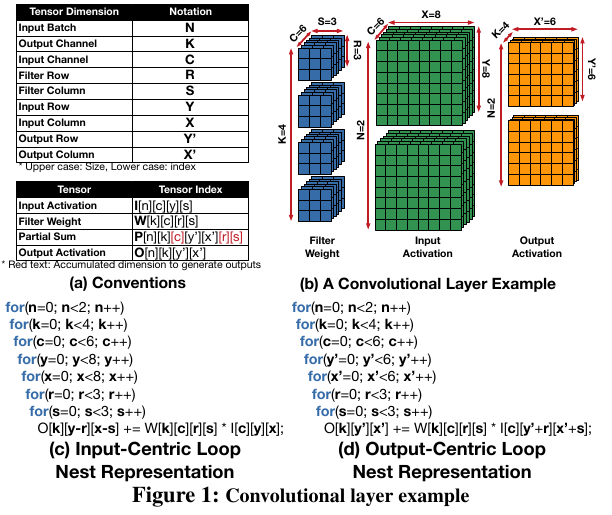
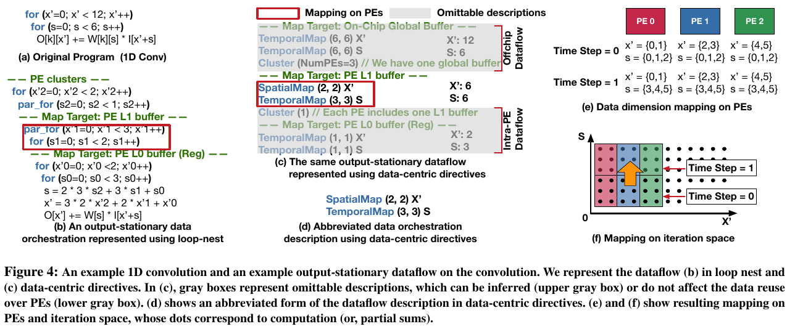
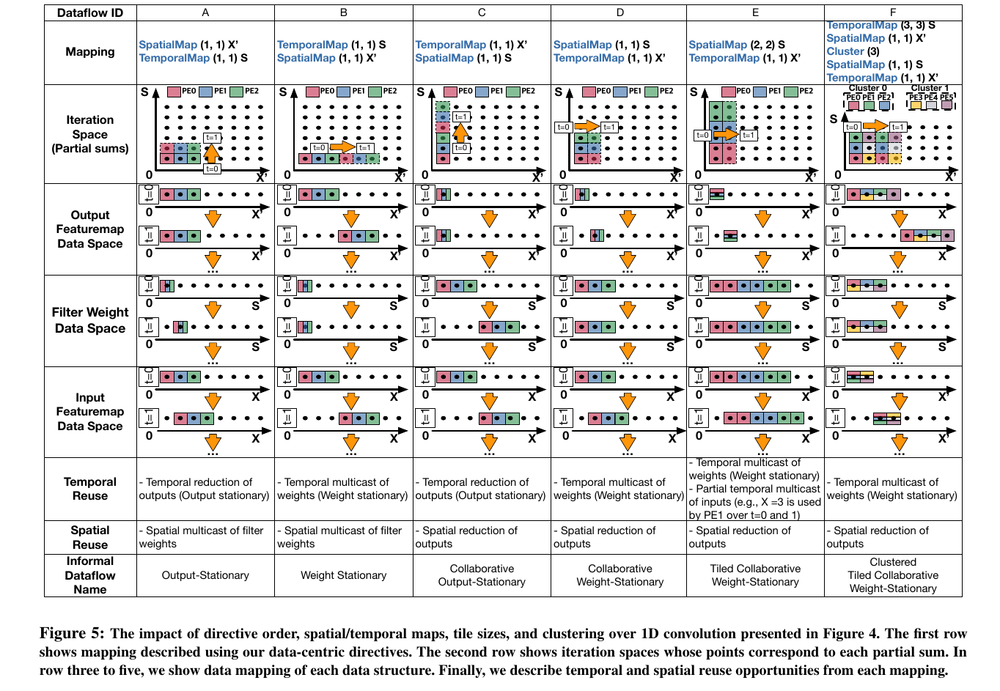
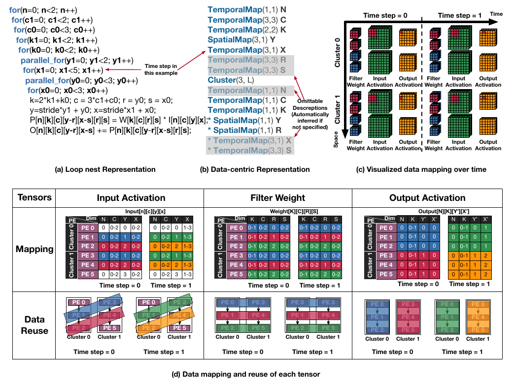
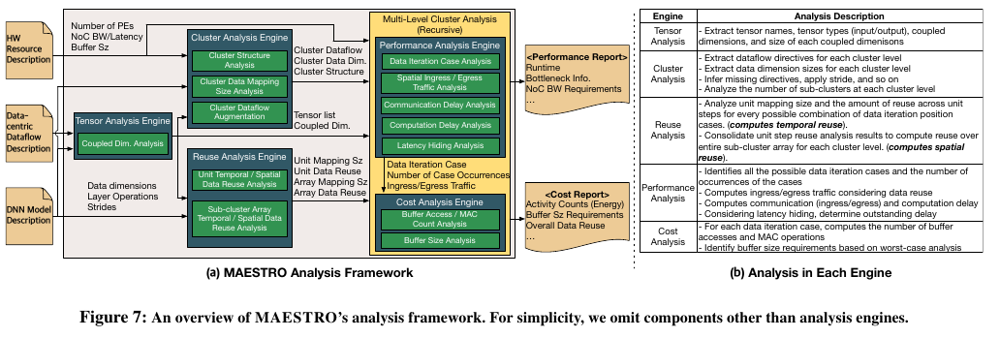
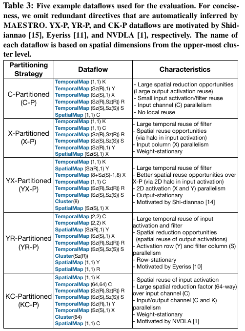
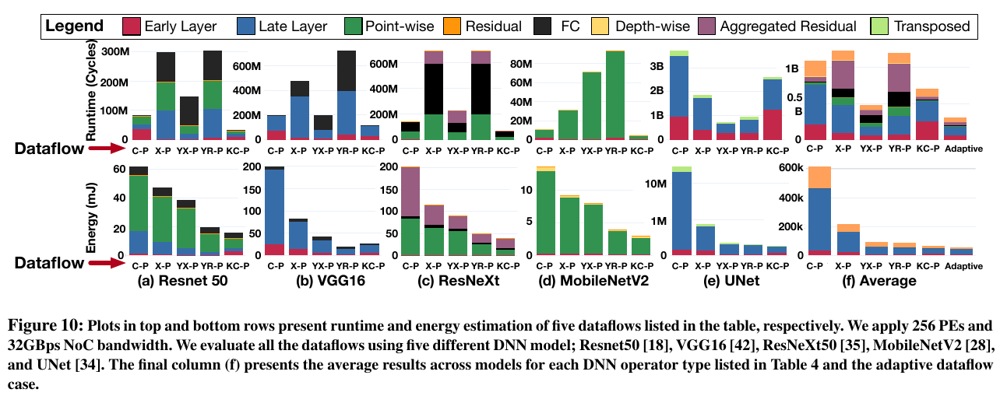

#Understanding Reuse, Performance, and Hardware Cost of DNN Dataflows: A Data-Centric Approach

##Abstract

introduce a set of data-centric directives to concisely specify the DNN dataflow space in a compiler-friendly form.
show how these directives can be analyzed to infer various forms of reuse and to exploit them using hardware capabilities.
codify this analysis into an analytical cost model, MAESTRO (Modeling Accelerator Efficiency via Spatio-Temporal Reuse and Occupancy), that estimates various cost-benefit tradeoffs of a dataflow including execution time and energy efficiency for a DNN model and hardware configuration.

##Tensors in DNNs

##Data-Centric Representation

###Spatial Map(size, offset): 
α specifies a distribution of dimension α (e.g., R, X) of a data structure across PEs, where size refers to the number of indices mapped in the dimension α to each PE, and offset describes the shift in the starting indices of α across consecutive PEs.

###Temporal Map(size, offset) α
specifies a distribution of dimension α of a data structure across time steps in a PE, and also the mapped chunk of dimension indices is the same across PEs in a time step. The size refers to the number of indices mapped in the dimension α to each PE, and offset describes the shift in the starting indices of α across consecutive time steps in a PE.

###Data Movement Order
The sequence of spatial and temporal maps in the dataflow specification dictate the order of data movement, i.e., the change of the data mappings to PEs across time.

##Dataflow Playground

##QUANTITATIVE DATAFLOW ANALYSIS

##DISCUSSION AND FUTURE WORK
introduced data-centric directives to specify DNN dataflows in a compact form and understand data reuse opportunities.
presented an analytical model called MAESTRO to estimate execution time, energy efficiency, and the hardware cost of dataflows.

